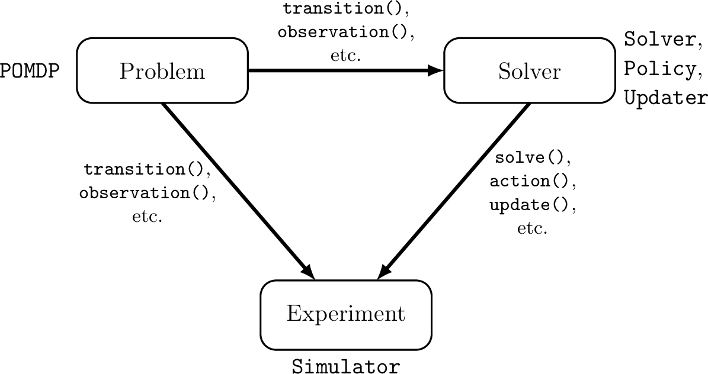

# Concepts and Architecture

POMDPs.jl aims to coordinate the development of three software components: 1) a problem, 2) a solver, 3) an experiment.
Each of these components has a set of abstract types associated with it and a set of functions that allow a user to define each component's behavior in a standardized way.
An outline of the architecture is shown below.



The MDP and POMDP types are associated with the problem definition.
The Solver and Policy types are associated with the solver.
Typically, the Updater type is also associated with the solver, but a solver may sometimes be used with an updater that was implemented separately.
The Simulator type is associated with the experiment. 

## POMDPs and MDPs

An MDP is a definition of a problem where the state of the problem is fully observable.
Mathematically, an MDP is a tuple (S,A,T,R), where S is the state space, A is the action space, T is a function that defines the probability of transitioning to each state given the state and action at the previous time, and R is a reward function mapping every possible transition (s,a,s') to a real reward value.
For more information see a textbook such as *Decision Making Under Uncertainty: Theory and Application* by Mykel J. Kochenderfer, MIT Press, 2015.
In POMDPs.jl an MDP is represented by a concrete subtype of the `MDP` abstract type and a set of methods that define each of its components.
S and A are defined by implementing methods of the `states` and `actions` functions for the `MDP` subtype, though for some solvers, the state space does not need to be explicitly defined.
T and R are defined by implementing methods of the `transition` and `reward` functions. 

A POMDP is a problem definition where the state is only partially observable by the decision making agent.
Mathematically, a POMDP is a tuple (S,A,T,R,O,Z) where S, A, T, and R have the same meaning as in the MDP case, O is the set of observations that the decision-making agent might receive and Z is a function defining the probability of receiving each observation at a transition.
In POMDPs.jl, a POMDP is represented by a concrete subtype of the `POMDP` abstract type, `O` may be defined by the `observations` function (though an explicit definition is often not required), and `Z` is defined by implementing a method of `observation` for the POMDP type.

POMDPs.jl also contains functions for defining optional problem behavior such as a discount factor or a set of terminal states.

## Beliefs and Updaters

The last important component of a POMDP is the initial distribution over the state of the agent. In POMDPs.jl we make a strong distinction
between this distribution and a belief. In most literature these two concepts are considered the same. However, in
most general terms, a belief is something that is mapped to an action using a POMDP policy. If the policy is represented
as something other than alpha-vectors (a policy graph, tree, or a reccurent neural netowrk to give a few examples), it
doesn't make sense to think of a belief as a probability distribution over the state space. Thus, in POMDPs.jl we
abstract the concept of a belief beyond a probability distribution (of course it can be a probability distriubtion if it
makes sense). 

In order to reconcile this difference, each policy has a function called ```initialize_belief``` which takes in an
initial state distirubtion (this is a probability distribution over the state space of a POMDP) and a policy, and converts the
distribution into what we call a belief in POMDPs.jl - a representation of a POMDP that is mapped to an action using the
policy. 

A belief has an ```Updater``` type associated with it. The ```Updater``` implements an ```update``` function which
updates the policy belief given an action and an observation. A function call to the update function may look like
```update(updater, action, observation)```.


## Solvers and Policies

A policy is a mapping from every belief that an agent might take to an action.


